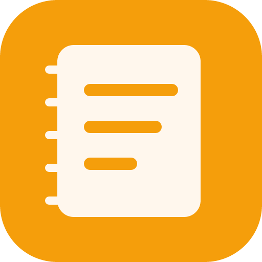

  

<h1 align="center">scan-lun</h1>

  A minimalist daily self-reflection tool: a scheduled popup of three fixed questions, living in the system tray, stored locally, with history review and Markdown / CSV export. 
  No AI, no cloud sync, no social features, no analytics.

  <a href="./README.md">简体中文</a> · <b><a href="./README.en.md">English</a></b>

  
  
  
  
  
  

> Note: scan-lun is a daily self-reflection app, **not** a file or network scanner.

---

## Quick Start

### Install

Download the installer for your platform from [Releases](https://github.com/xianglun918/scan-lun/releases):

- macOS: `dmg`
- Windows: `exe` / `msi`
- Linux: `AppImage` / `deb`

### First Run

After installing, launch scan-lun. It quietly sits in the system tray. Before anything else, open **Settings** and set the reminder time and the three questions to fit your own rhythm.

When the scheduled time arrives (the default is 18:00 daily), the three-question form pops up and grabs focus. You can also open it manually from the tray menu via "Fill in now".

## Daily Workflow

Each day at the scheduled time the app pops up the three-question form. All you do is answer the three questions:

- **Save**: commit today's entry to the local database; no more nudges today.
- **Remind Later**: bring the form back in one hour, handy when you're busy.
- **Skip**: dismiss it for the day without saving.

Once a day is answered, any path to the popup (scheduled / tray / snoozed re-fire) shows only a "done for today" notice instead of a blank form.

Reviewing and exporting live in the main window (click the tray icon or use the tray menu's "Open scan-lun"): switch to **History** to browse past entries, or open **Settings** to adjust options.

## Features

- **Daily scheduled reminder**: the form pops up on time; a finished day is never nagged again.
- **Customizable questions**: ships with a workplace reflection template; edit the wording in Settings.
- **Local SQLite storage**: plain text on your machine, never uploaded, never online.
- **History view**: browse past entries, grouped by date.
- **Markdown / CSV export**: one click in History exports everything.
- **Workday-only reminders + launch at login**: both toggles live in Settings.

For a full walkthrough of every feature path, see [story-line.md](./story-line.md).

## Settings & Privacy

### Settings

| Setting | Description |
|---|---|
| Daily reminder time | when the popup appears (HH:MM) |
| Workday-only reminders | skip Saturday and Sunday when enabled |
| Launch at login | start with the system (macOS LaunchAgent) |
| Three-question template | all three prompts are editable |

### Privacy

All data lives in `scan-lun.db` (plain-text SQLite) under your local app data directory. The app uploads nothing and never touches the network. When exporting Markdown or CSV, you pick where the file goes.

## FAQ

**Where is my data stored?**
In `scan-lun.db` under your local app data directory. The exact path depends on your OS (for example `~/Library/Application Support/com.scanlun.app/scan-lun.db` on macOS).

**Can I sync across devices?**
No. scan-lun deliberately avoids cloud sync. All data stays on the machine where it was written.

**How do I reset or export my data?**
To export, open **History** and click "Export MD" or "Export CSV". To reset, click "Clear all data" in Settings, or simply delete `scan-lun.db`.

## Development

This repo is aimed at users. If you want to run from source, modify the code, or build installers, see the developer guide.

→ [docs/development.md](./docs/development.md) · tech stack, requirements, local dev and build.

## License

[MIT](./LICENSE) © 2026 xianglun918
